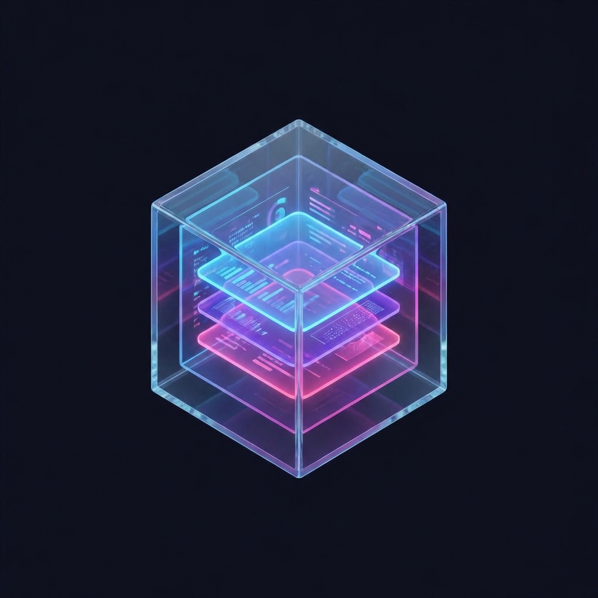
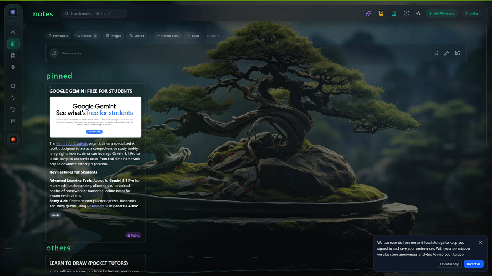
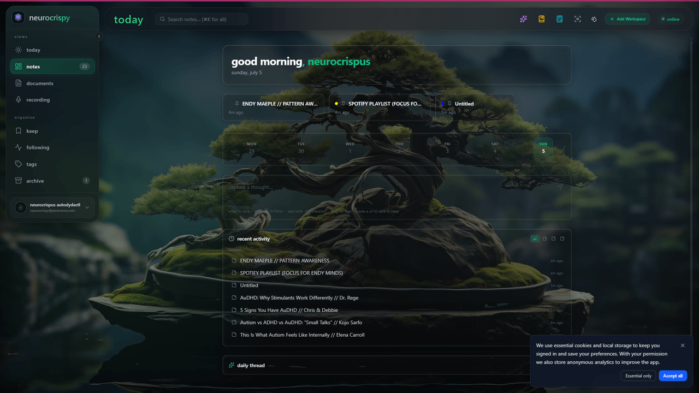
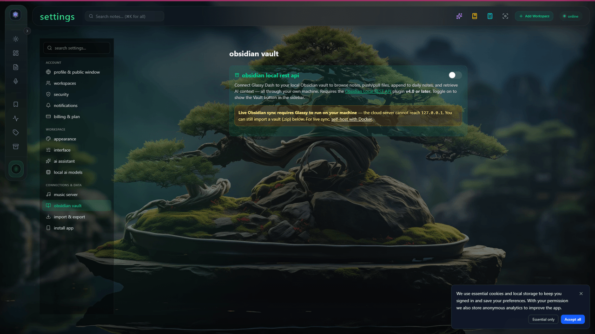
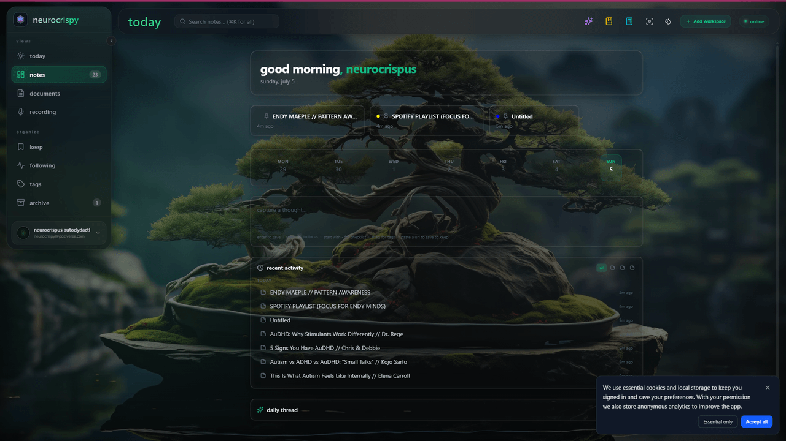
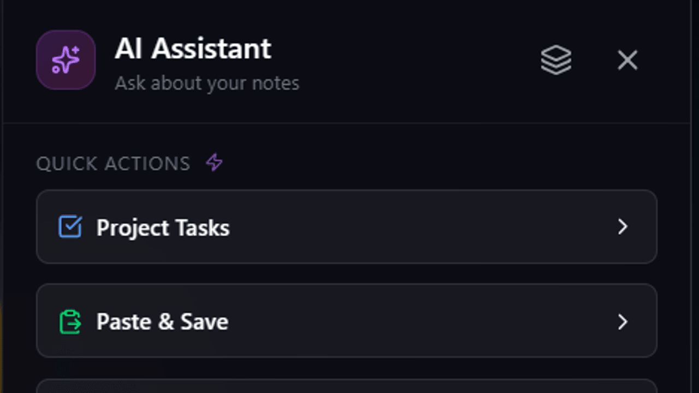

<div align="center">



# Glassy — self-hosted

**A calm, neurodivergent-friendly workspace. Notes, bookmarks, voice transcription,
and local AI — on one page. Your data stays on your machine.**

[](https://github.com/0Reliance/glassy-selfhost/releases)
[](https://ghcr.io/0reliance/glassy-dash)
[](LICENSE)
[](https://docs.docker.com/get-started/)

[Cloud app](https://app.glassy.fyi) · [Docs](https://docs.glassy.fyi) · [Companion extension](https://github.com/0Reliance/glassy-companion) · [Release notes](https://github.com/0Reliance/glassy-selfhost/releases)

</div>

---


---

## Why self-host

The cloud version of Glassy is great. Self-hosting is for the cases where the
cloud fundamentally cannot help — because the server cannot reach your machine.

| | Cloud | Self-hosted |
| --- | :---: | :---: |
| Notes, tags, documents | ✅ | ✅ |
| Live Obsidian vault sync | ❌ server ≠ localhost | ✅ |
| Ollama local AI models | ❌ | ✅ |
| Agent Gateway (OpenClaw, Hermes) | ❌ | ✅ |
| MCP server + Second Brain | ❌ | ✅ |
| All premium features unlocked | Pro plan required | ✅ owner auto-unlocked |
| Single-owner / no registration | ❌ | ✅ enforced at server level |
| Data stays on your machine | ❌ | ✅ |
| Commerce / billing surfaces | ✅ | ❌ not present |
| Telemetry (Sentry) | ✅ | ❌ not initialised |

---

## Quick start

> **Self-hosting requires an active Glassy membership** (Clear or Pro).
> Sign up at [clear.glassy.fyi](https://clear.glassy.fyi) or [glassy.fyi](https://glassy.fyi)
> before continuing — the appliance will not start without your membership email.

```bash
git clone https://github.com/0Reliance/glassy-selfhost.git
cd glassy-selfhost
cp .env.example .env
```

Open `.env` and fill in the **three required fields**:

```env
# Your Glassy account email (Clear or Pro membership)
GLASSY_MEMBER_EMAIL=your@glassy-account-email

# Generate each one with: openssl rand -hex 32
JWT_SECRET=
API_KEY_ENCRYPTION_KEY=
```

Then:

```bash
docker compose up -d
```

On first boot the appliance verifies your membership against the cloud, creates
your local account using your membership email, and prints the initial password
**once**:

```bash
docker compose logs glassy | grep -A2 "Default admin created"
```

Sign in at **http://localhost:3000** with your membership email and that password,
then set a permanent password in **Settings → Account**.
Registration is permanently disabled — this is a single-owner appliance.
All premium features are unlocked automatically.

---

## What's inside

### Notes, documents & rich editor

Rich TipTap editor with a slash-command palette, callout blocks, task lists,
tables, code blocks, and LaTeX math. Markdown-native storage — every note
exports cleanly to `.md` with no lock-in.



### GlassyKeep — bookmarks

Save pages with the Glassy Companion browser extension. Search your entire
saved library by meaning, not just keywords. Read archived pages without
opening a new tab.

### Voice Studio

Local voice transcription powered by Whisper running in your browser.
Record, transcribe, and structure voice memos — no cloud account, no
per-minute fees. Everything stays on your device.



### Obsidian live sync

Keep your vault. Add a calm web cockpit on top.

Glassy connects to the [Obsidian Local REST API plugin](https://github.com/coddingtonbear/obsidian-local-rest-api)
running on your machine. Browse vault files, open and edit any note, push
content from Glassy to your vault, and pull your daily note into the
dashboard — all in one interface.

Live two-way sync requires the server to be on the same machine as Obsidian.
The cloud server cannot do that. Self-hosting can.



### Second Brain / MCP server

Glassy exposes a full [Model Context Protocol](https://modelcontextprotocol.io)
server so AI agents — Claude Desktop, Cursor, or any MCP-compatible client —
can read and write directly into your workspace.

**10 MCP tools:** search, recent, note create/update/delete, bookmark update/delete,
Obsidian vault query, Obsidian MCP proxy.  
**3 MCP prompts:** daily brief, summarize, capture.  
**3 dynamic resources:** `glassy://kb/search/{query}`, `glassy://recent/{type}`, `glassy://status`.

The Knowledge Base (`#/kb`) provides hybrid BM25 + vector semantic search
across everything you've saved. The self-hosted owner is on the Pro tier:
1,200 MCP tool calls per hour.



### AI writing assistant

Local AI runs inside your browser via WebGPU — Qwen 2.5, Whisper, and MXBai
models require no account and consume no credits. Cloud AI (Gemini, OpenAI,
Anthropic, Mistral) is available as BYOK: add your key in Settings → API Keys,
stored encrypted in the database. No cloud API key is read from the compose file
or `.env`.



### Agent Gateway

Dispatch tasks to local AI agent frameworks — OpenClaw, Hermes, Antigravity —
directly from the sidebar. The gateway bridges Glassy to agent APIs running on
`localhost`, with SSRF protection, an activity feed, and one-click MCP config
snippets for Claude Desktop and Cursor.

### GlassyCalc · Following · Themes

A spreadsheet sidecar alongside your notes. RSS following with no separate reader.
Ten glassmorphic theme packs with custom accent colors and per-note backgrounds.

---

## Local AI — bundled Ollama

Glassy detects Ollama on the host automatically via `host.docker.internal:11434`.
If you don't already run Ollama, the included overlay starts it as a sidecar —
nothing to install on the host:

```bash
docker compose -f docker-compose.yml -f docker-compose.ollama.yml up -d

# Pull a model once (stored in the ollama-models volume):
docker compose -f docker-compose.yml -f docker-compose.ollama.yml \
  exec ollama ollama pull llama3.2
```

Glassy points itself at the sidecar automatically. Have an NVIDIA GPU? Uncomment
the `deploy` block in [`docker-compose.ollama.yml`](docker-compose.ollama.yml)
after installing the [NVIDIA Container Toolkit](https://docs.nvidia.com/datacenter/cloud-native/container-toolkit/install-guide.html).

---

## Multi-device access

### Tailscale (recommended)

[Tailscale](https://tailscale.com/) is a WireGuard mesh — no port forwarding,
no TLS setup, no public exposure. Install it on the host:

```bash
curl -fsSL https://tailscale.com/install.sh | sh && sudo tailscale up
```

Set in `.env`:

```env
APP_URL=http://<this-machine>.tail-net.ts.net:3000
CORS_ORIGINS=http://localhost:3000,http://<this-machine>.tail-net.ts.net:3000
```

Then set the Glassy Companion on your phone to the same hostname for
one-keystroke capture over Tailscale.

### Automatic HTTPS via Caddy

If you have a domain with a public A record pointing at this host:

```bash
# in .env:
#   GLASSY_DOMAIN=glassy.example.com
#   APP_URL=https://glassy.example.com
#   CORS_ORIGINS=https://glassy.example.com
docker compose -f docker-compose.yml -f docker-compose.https.yml up -d
```

Caddy provisions and renews a Let's Encrypt certificate automatically.

### Cloudflare Tunnel

Public HTTPS via Cloudflare's edge — no port forwarding, free TLS. Setup in
[`SELF_HOSTED_DEPLOYMENT.md`](SELF_HOSTED_DEPLOYMENT.md).

---

## Upgrading

```bash
docker compose pull && docker compose up -d
```

Migrations run automatically. To auto-update daily without manual steps, add
the Watchtower overlay:

```bash
docker compose -f docker-compose.yml -f docker-compose.watchtower.yml up -d
```

Pin `GLASSY_TAG=v2.35.0` in `.env` to upgrade on your own schedule.

---

## Backups

Automatic daily backup at 02:00 (SQLite snapshot, ~7 days retained, no setup).
For encrypted off-machine copies:

```bash
# Set BACKUP_ENCRYPTION_KEY=<openssl rand -hex 32> in .env first, then:
docker compose exec glassy node server/utils/backup.js            # create
docker compose exec glassy node server/utils/backup.js --restore <file>
```

Full volume snapshot:

```bash
docker run --rm -v glassy-data:/data -v $(pwd):/backup alpine \
  tar czf /backup/glassy-backup.tar.gz -C /data .
```

---

## Configuration

| Variable | Default | |
| --- | --- | --- |
| `GLASSY_MEMBER_EMAIL` | **required** | Your Clear or Pro membership email |
| `JWT_SECRET` | **required** | `openssl rand -hex 32` |
| `API_KEY_ENCRYPTION_KEY` | **required** | `openssl rand -hex 32` |
| `APP_URL` | `http://localhost:3000` | Set for Tailscale / domain access |
| `CORS_ORIGINS` | `http://localhost:3000` | Must include every origin you use |
| `GLASSY_TAG` | `latest` | Pin a version for reproducibility |
| `APP_PORT` | `3000` | Host port Glassy listens on. Change if port 3000 is in use — then update `APP_URL` + `CORS_ORIGINS` to match. |
| `OLLAMA_BASE_URL` | `http://host.docker.internal:11434` | Ollama on host (default); the server auto-appends `/v1` if missing. Use `http://ollama:11434` with the sidecar overlay |
| `OLLAMA_MODEL` | `llama3.2` | Default model when none is selected in-app |
| `BACKUP_ENCRYPTION_KEY` | — | AES-256-GCM; `openssl rand -hex 32` |
| `CLUSTER_WORKERS` | `min(2, CPUs−1)` | Raise on multi-core hosts |
| `MCP_PRO_TOOLCALLS_PER_HOUR` | `1200` | Raise for heavy agent automation |
| `GLASSY_DOMAIN` | — | Required for Caddy HTTPS overlay |

Cloud AI keys are not read from `.env` — add them in-app at **Settings → API Keys**.
See [`.env.example`](.env.example) for the full annotated list.

---

## Security model

The appliance enforces these gates server-side. They cannot be overridden by
environment variables or admin settings:

- **Registration hard-disabled.** `/api/auth/register` returns 403 before any
  admin check fires.
- **Commerce routes not mounted.** `/api/commerce/*` and `/api/stripe/*` → 404.
- **Email permanently off.** Nothing leaves the machine. Use the admin reset
  path or a secret recovery key (Settings → Security) to recover a lost password.
- **Telemetry off.** Sentry is not initialised even if `SENTRY_DSN` is set.
- **AI credit metering off.** BYOK calls go directly to your provider.

`.env` is excluded from version control by `.gitignore`. Never commit it.

---

## Troubleshooting

### Port 3000 already in use

If another service is using port 3000 (common for dev tools), set a
different port in `.env`:

```env
APP_PORT=3001
APP_URL=http://localhost:3001
CORS_ORIGINS=http://localhost:3001
```

Then `docker compose up -d`. The container always listens on 8080 internally;
`APP_PORT` only changes the host-side mapping.

> **⚠️ If you change `APP_PORT`, you must also update `APP_URL` and `CORS_ORIGINS` to the same port.** All three must agree, or login and API calls will fail with CORS errors.

### Checking container health

To verify the container is healthy from the host:

```bash
# Canonical health endpoint (used by Docker healthcheck):
curl http://localhost:3000/api/monitoring/ready

# Convenience alias:
curl http://localhost:3000/ready
```

Both return JSON with `"status":"ready"` when healthy. If you get HTML
instead, the container may still be starting up — wait a few seconds and
retry.

### Debugging from inside the container

The runtime image includes `curl` for network diagnostics:

```bash
# Enter the container:
docker compose exec glassy sh

# Test Ollama connectivity from inside the container:
curl -s http://host.docker.internal:11434/api/tags | head -c 200

# Test membership-verification endpoint reachability:
curl -s -o /dev/null -w "%{http_code}" https://app.glassy.fyi/api/verify-selfhost
```

### Container logs

```bash
# Full logs:
docker compose logs glassy

# Follow logs:
docker compose logs -f glassy

# Check for membership verification status:
docker compose logs glassy | grep -i "membership"

# Check for Agent Gateway mount status:
docker compose logs glassy | grep -i "Agent Gateway"
```

---

## The Glassy ecosystem

| | |
| --- | --- |
| **[app.glassy.fyi](https://app.glassy.fyi)** | Cloud-hosted — zero setup, accessible from anywhere |
| **[glassy-companion](https://github.com/0Reliance/glassy-companion)** | Browser extension — one-keystroke capture, Obsidian sync |
| **[docs.glassy.fyi](https://docs.glassy.fyi)** | Documentation |
| **[learn.glassy.fyi](https://learn.glassy.fyi)** | Guides and video lessons |
| **[glassy.fyi](https://glassy.fyi)** | Marketing site and Clear community |

---

<div align="center">

Built and maintained by [0Reliance Lab](https://github.com/0Reliance) ·
[Report an issue](https://github.com/0Reliance/glassy-selfhost/issues) ·
[Releases](https://github.com/0Reliance/glassy-selfhost/releases)

**Keep it Glassy.**

</div>
